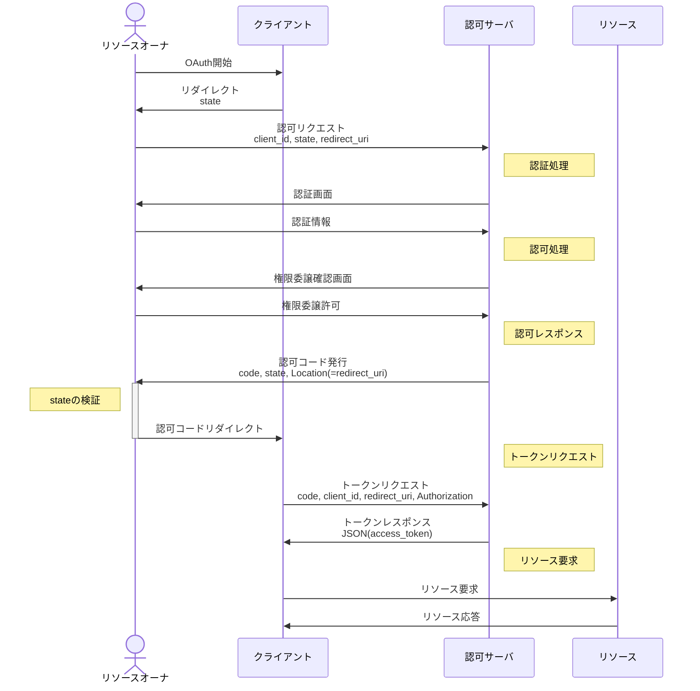
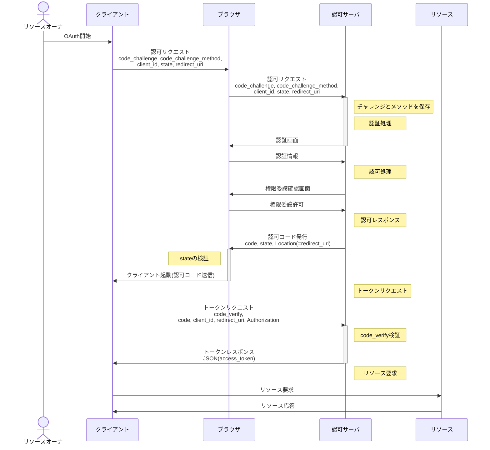
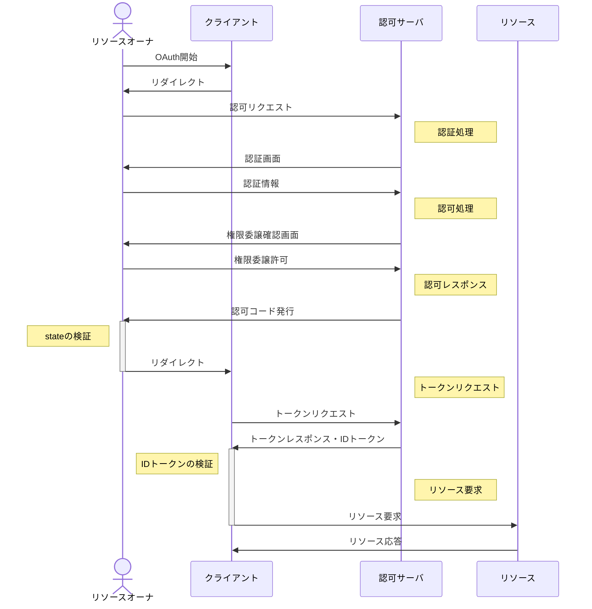
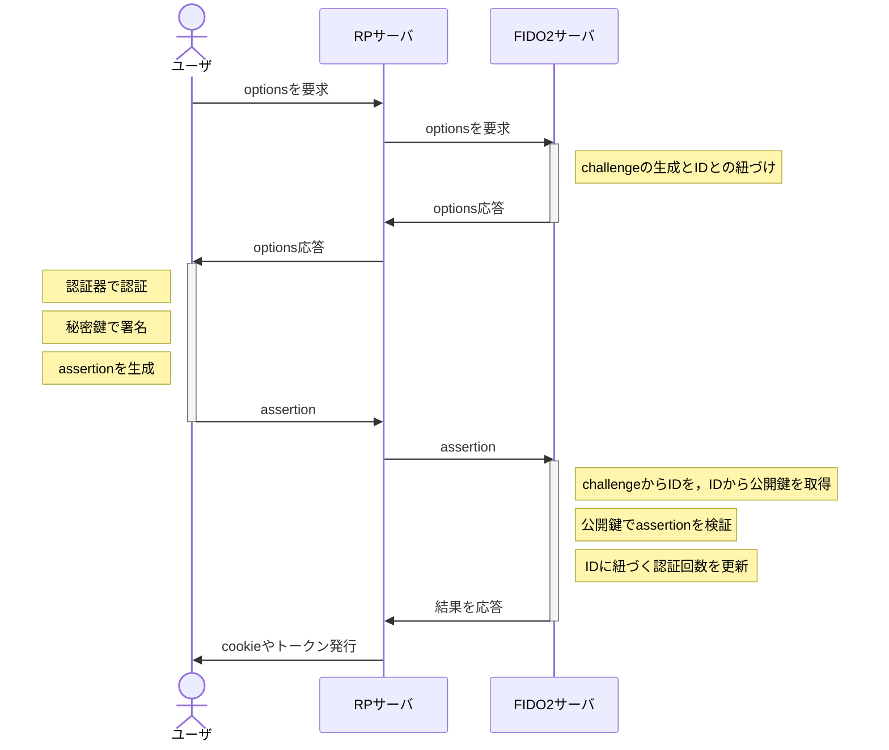

# typing-game

This template should help get you started developing with Vue 3 in Vite.

## Recommended IDE Setup

[VSCode](https://code.visualstudio.com/) + [Volar](https://marketplace.visualstudio.com/items?itemName=Vue.volar) (and disable Vetur).

## Type Support for `.vue` Imports in TS

TypeScript cannot handle type information for `.vue` imports by default, so we replace the `tsc` CLI with `vue-tsc` for type checking. In editors, we need [Volar](https://marketplace.visualstudio.com/items?itemName=Vue.volar) to make the TypeScript language service aware of `.vue` types.

## Customize configuration

See [Vite Configuration Reference](https://vite.dev/config/).

## Project Setup

```sh
npm install
```

### Compile and Hot-Reload for Development

```sh
npm run dev
```

### Type-Check, Compile and Minify for Production

```sh
npm run build
```

### Run Unit Tests with [Vitest](https://vitest.dev/)

```sh
npm run test:unit
```

### Run End-to-End Tests with [Cypress](https://www.cypress.io/)

```sh
npm run test:e2e:dev
```

This runs the end-to-end tests against the Vite development server.
It is much faster than the production build.

But it's still recommended to test the production build with `test:e2e` before deploying (e.g. in CI environments):

```sh
npm run build
npm run test:e2e
```

### Lint with [ESLint](https://eslint.org/)

```sh
npm run lint
```

# OAuth2.0



- client_id: クライアントID
- **state: CSRF対策用の乱数**
- redirect_uri: クライアントへのリダイレクト先、(スキームの部分はクライアント特有の値 ex) myapp://...) 
- **code: 認可コード**
- JWT(JSON Web Token): アクセストークン文字列、期限、Bearerトークンを含む

# OAuth2.0 + PKCE
Proof Key for Code Exchange
罠クライアントが、正当クライアントと同じカスタムスキームを持ち、かつリソースオーナのclient_idを知っている場合に
リソースオーナが罠クライアントを利用してしまい、code(認可コード)の値を罠クライアントが取得する場合。



code_challenge: チャレンジ
code_challenge: plain(平文)かS256(チャレンジをSHA256でエンコードした値をBase64エンコード)
初めにクライアントがチャレンジとそのメソッド(ハッシュ関数)をブラウザ経由で認可サーバに送信し、認可サーバが保存する。認可サーバはトークンリクエスト時に、クライアントから送信されたcode_verifyがcode_challengeと一致するか検証する。一致すれば正当なクライアント、一致しなければ罠クライアントである。

# OIDC(OpenID Connect)
認可だけではなく、認証が可能。(**OIDC = OAuth2.0 + 認証**)
OAuth2.0ではアクセストークンの発行が

トークンレスポンス時に、IDトークンを渡す。
IDトークンはJWT(JSON Web Token)形式で以下の値を持つ。
```json
{
  "iss": Issuer(発行者),
  "aud": Audience(クライアントID),
  "sub": Subject(リソースオーナの識別子),
  "iat": Isuued␣At(JWT発行期間),
  "exp": expire(JWT有効期間), 
  "nonce": リプレイ防止用ノンス
}
```

# FIDO(Fast IDentify Online2)
クレデンシャルを送信しない認証

RP(Relaying Party)はFIDOを提供するIDプロバイダを指す．そのためRPサーバとFIDO2サーバはユーザから見たら1つのサーバである．
assertion(≒デジタル署名)を送信するため，クレデンシャルがネットワーク上に流れない．
登録時はユーザが認証器上で鍵ペアを作成後，attestationとして送信し，公開鍵をFIDO2サーバへ送信する．

実際には，スマートフォンの指紋認証やカメラが認証器となり，スマートフォンのWebブラウザからRPアプリケーション(Webアプリケーション)にアクセスし，
RPアプリケーションがRPサーバと通信を行う．そのためWebブラウザとRPアプリケーションの通信はWebAuthnと呼ばれ，認証器とRPサーバとの橋渡しをAPIで行う．
